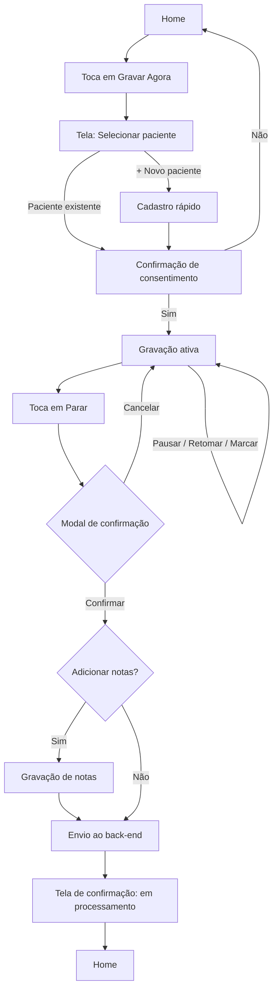
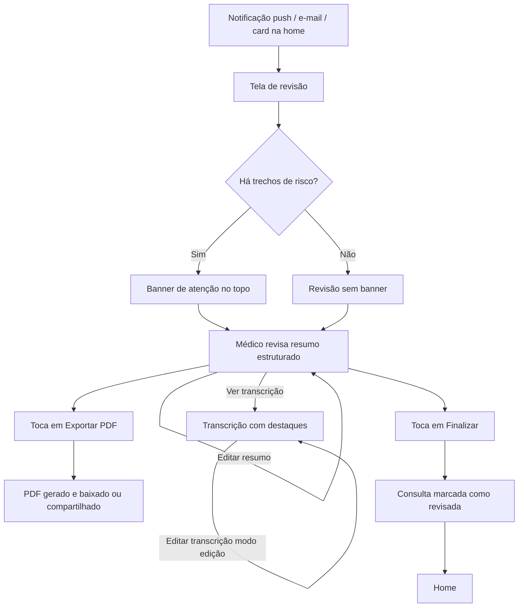
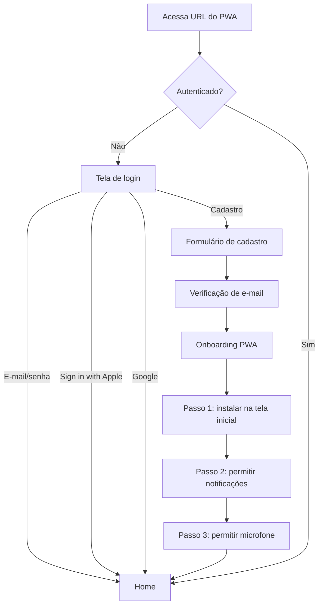

# Especificações UX/UI — App de Gravação e Transcrição de Consultas Psiquiátricas

**Versão:** 0.1
**Data:** 17 de abril de 2026
**Base:** PRD v0.2
**Status:** Rascunho para implementação

---

## 1. Arquitetura da Informação

### 1.1 Mapa de telas

```
├── (público)
│   ├── Login
│   ├── Cadastro
│   ├── Recuperação de senha
│   └── Onboarding PWA (instalação + permissões)
│
└── (autenticado)
    ├── 🏠 Home
    ├── 🎙️ Consultas
    │   ├── Lista (filtrável por status)
    │   ├── Detalhes da consulta
    │   └── Revisão da consulta
    ├── 👥 Pacientes
    │   ├── Lista
    │   ├── Cadastro / Edição
    │   └── Detalhes do paciente (com histórico)
    ├── 🔔 Notificações
    ├── ⚙️ Configurações
    │   ├── Perfil
    │   ├── Conta
    │   ├── Notificações
    │   ├── Privacidade e LGPD
    │   │   ├── Exportar meus dados
    │   │   └── Excluir conta (confirmação dupla)
    │   └── Exclusão individual de consultas
    │
    └── (fluxos modais — sem navegação por drawer)
        ├── Seleção de paciente
        ├── Confirmação de consentimento
        ├── Gravação ativa
        ├── Confirmação de encerramento
        └── Gravação de notas complementares
```

### 1.2 Navegação principal

**Drawer (menu hambúrguer):** ícone no canto superior esquerdo em todas as telas autenticadas, exceto nos fluxos modais de gravação. Conteúdo do drawer:

```
┌──────────────────────┐
│  [Avatar]            │
│  Dr(a). Nome         │
│  CRM 00000           │
├──────────────────────┤
│  🏠 Home             │
│  🎙️ Consultas        │
│  👥 Pacientes        │
│  🔔 Notificações  •3 │  ← badge não-lidas
│  ⚙️ Configurações    │
├──────────────────────┤
│  Sair                │
└──────────────────────┘
```

### 1.3 Zonas de layout por breakpoint

| Breakpoint | Comportamento |
|------------|---------------|
| **Mobile (< 768px)** | Single column, drawer como overlay, tabs para alternar entre resumo e transcrição na revisão |
| **Tablet (768–1024px)** | Single column otimizado, drawer persistente opcional |
| **Desktop (≥ 1024px)** | Drawer fixo à esquerda, split view lado a lado na revisão, largura máxima de conteúdo 1280px |

### 1.4 Padrões de organização

- **Home:** hierarquia de ação dominante (CTA gigante) + conteúdo contextual abaixo.
- **Listas (Consultas, Pacientes, Notificações):** cabeçalho com busca/filtros → lista scrollable → FAB de ação primária no mobile.
- **Detalhes:** header com informações-chave → ações primárias destacadas → conteúdo secundário (histórico, metadados) em rolagem.
- **Revisão:** layout bifocal (resumo + transcrição) com alertas contextuais no topo.

---

## 2. Fluxos de Usuário Principais

### 2.1 Fluxo crítico — Gravação de consulta



**Estado alternativo — conectividade:** se não houver internet ao encerrar, o áudio permanece em fila no IndexedDB e é enviado quando a conectividade retornar. O médico vê indicador "Aguardando sincronização" na Home e na consulta.

### 2.2 Fluxo crítico — Revisão do resultado



### 2.3 Fluxo — Autenticação e primeiro uso



### 2.4 Estados de erro e recuperação

| Erro | Tela de origem | Comportamento |
|------|----------------|---------------|
| Permissão de microfone negada | Gravação | Tela bloqueia com instrução visual + botão "Abrir configurações do navegador" |
| Wake Lock indisponível | Gravação | Toast de aviso + orientação "Mantenha a tela ativa manualmente" |
| Falha no upload do áudio | Pós-gravação | Card na home: "Falha ao enviar — tentar novamente" |
| Falha no processamento | Notificações + Lista de consultas | Item com status "Erro" + botão "Reprocessar" |
| Sessão expirada | Qualquer tela autenticada | Redirect para login preservando deep link |
| Sem conectividade | Qualquer | Banner superior persistente "Você está offline" |

---

## 3. Especificações de Telas

### 3.1 Home

```
┌────────────────────────────────────┐
│ ☰  Olá, Dr(a). [Nome]           🔔│
│                                    │
│  ┌──────────────────────────────┐  │
│  │                              │  │
│  │         🎙️                  │  │
│  │     GRAVAR AGORA             │  │
│  │                              │  │
│  └──────────────────────────────┘  │
│                                    │
│  ⚠️ 1 consulta pendente de revisão │
│  ┌──────────────────────────────┐  │
│  │ João Silva                   │  │
│  │ Hoje, 14:30 · pronta         │  │
│  │                   [Revisar →]│  │
│  └──────────────────────────────┘  │
│                                    │
│  Últimas consultas                 │
│  ────────────────────────────────  │
│  Maria Lima       · ontem          │
│  Pedro Rocha      · 2 dias atrás   │
│  Ana Costa        · 3 dias atrás   │
│                                    │
│           [Ver todas →]            │
└────────────────────────────────────┘
```

**Estados:**
- **Vazio (novo usuário):** CTA + card de boas-vindas com explicação breve do produto + link "Cadastrar primeiro paciente".
- **Com pendência:** card "Consulta pendente" aparece entre CTA e lista recente.
- **Processando:** card "Consulta em processamento — pronta em ~5 min" com progresso indeterminado.
- **Offline:** banner superior + CTA desabilitado com tooltip "Disponível quando online" (gravação ainda funciona offline, mas não o envio).

**Prioridade visual:** CTA > pendência > lista recente.

### 3.2 Seleção de Paciente

```
┌────────────────────────────────────┐
│ ← Cancelar    Selecionar paciente  │
│                                    │
│  🔍 Buscar paciente...             │
│                                    │
│  ─── Último atendido ───           │
│  João Silva · 42 anos              │
│  Última consulta: 03/04/2026       │
│                                    │
│  ─── Todos os pacientes ───        │
│  Ana Costa                         │
│  Maria Lima                        │
│  Pedro Rocha                       │
│  ...                               │
│                                    │
│  ┌──────────────────────────────┐  │
│  │   + Cadastrar novo paciente  │  │
│  └──────────────────────────────┘  │
└────────────────────────────────────┘
```

**Comportamento:** toque em paciente → avança para confirmação de consentimento. Cadastro de novo paciente abre modal ou tela intermediária com campos mínimos e retorna ao fluxo ao concluir.

### 3.3 Confirmação de Consentimento

```
┌────────────────────────────────────┐
│ ← Voltar                           │
│                                    │
│  Paciente: João Silva              │
│                                    │
│  ┌──────────────────────────────┐  │
│  │                              │  │
│  │  Antes de iniciar a gravação │  │
│  │                              │  │
│  │  O consentimento do paciente │  │
│  │  para esta gravação foi      │  │
│  │  obtido?                     │  │
│  │                              │  │
│  │   ☐  Sim, o paciente         │  │
│  │      autorizou esta gravação │  │
│  │                              │  │
│  └──────────────────────────────┘  │
│                                    │
│  ℹ️ Grave também o consentimento   │
│     verbalmente no início da       │
│     consulta.                      │
│                                    │
│  ┌──────────────────────────────┐  │
│  │   Iniciar gravação           │  │  ← desabilitado até checkbox
│  └──────────────────────────────┘  │
└────────────────────────────────────┘
```

**Regra:** botão "Iniciar gravação" habilitado somente após marcar o checkbox. Essa é a guarda de RF-03.

### 3.4 Gravação Ativa (tela crítica)

```
┌────────────────────────────────────┐
│                                    │
│  João Silva                        │
│                                    │
│                                    │
│          00:12:34                  │  ← timer grande
│                                    │
│       ▁▂▃▅▇▅▃▂▁▂▃▅▇▅▃▂             │  ← waveform discreta
│                                    │
│          🔴 Gravando                │
│                      · 3 marcadores │
│                                    │
│                                    │
│                                    │
│  ┌──────────────────────────────┐  │
│  │     🚩  Marcar momento       │  │  ← CTA principal durante grav.
│  └──────────────────────────────┘  │
│                                    │
│  ┌────────────┐    ┌────────────┐  │
│  │ ⏸ Pausar   │    │ ⏹ Parar    │  │
│  └────────────┘    └────────────┘  │
└────────────────────────────────────┘
```

**Estados:**
- **Gravando:** ponto vermelho pulsante + texto "Gravando".
- **Pausado:** ponto amarelo estático + texto "Pausado" + botão "Pausar" vira "Retomar".
- **Marcador adicionado:** flash branco de ~200ms sobre a tela + vibração curta (navigator.vibrate) + contador de marcadores incrementa.
- **Erro de captura:** toast de erro + sugestão "Verifique permissões do microfone".

**Regras:**
- Drawer oculto (gravação modal).
- Tentativa de fechar aba/navegador dispara prompt de confirmação nativo (`beforeunload`).
- Toque em "Parar" abre modal:

```
┌──────────────────────────────────┐
│  Encerrar gravação?              │
│                                  │
│  A consulta atual será enviada   │
│  para processamento.             │
│                                  │
│  [Cancelar]       [Encerrar]     │
└──────────────────────────────────┘
```

### 3.5 Notas Complementares (pós-gravação)

```
┌────────────────────────────────────┐
│ ← Voltar                           │
│                                    │
│  Gravação encerrada ✓              │
│                                    │
│  Deseja adicionar notas ditadas    │
│  agora? (opcional)                 │
│                                    │
│  Notas são impressões pessoais do  │
│  médico, gravadas sem o paciente,  │
│  que entram no resumo estruturado. │
│                                    │
│  ┌──────────────────────────────┐  │
│  │  🎙️ Gravar notas             │  │
│  └──────────────────────────────┘  │
│                                    │
│  ┌──────────────────────────────┐  │
│  │  Pular e enviar               │  │
│  └──────────────────────────────┘  │
└────────────────────────────────────┘
```

### 3.6 Revisão da Consulta (mobile)

```
┌────────────────────────────────────┐
│ ← Voltar         [⬇ Exportar PDF]  │
│                                    │
│  João Silva · 17/04/2026 · 34 min  │
│                                    │
│  ✓ Consentimento registrado        │  ← badge verde
│  ⚠️ 2 trechos de atenção           │  ← banner âmbar, se houver
│                              [ver→]│
│                                    │
│  ┌──────────────┬──────────────┐   │
│  │  Resumo  ●   │  Transcrição │   │  ← tabs
│  └──────────────┴──────────────┘   │
│                                    │
│  Histórico Psiquiátrico            │
│  ────────────────────────────      │
│  [texto editável inline...]        │
│                                    │
│  Exame do Estado Mental            │
│  ────────────────────────────      │
│  [texto editável inline...]        │
│                                    │
│  Medicações em uso                 │
│  ────────────────────────────      │
│  [texto editável inline...]        │
│                                    │
│  Hipótese diagnóstica (CID-10)     │
│  ────────────────────────────      │
│  F33.1 — Transtorno depressivo     │
│         recorrente, episódio atual │
│         moderado                   │
│                                    │
│  Conduta / Prescrição              │
│  ────────────────────────────      │
│  [texto editável inline...]        │
│                                    │
│  ──────────────────────────────    │
│  [Finalizar revisão]               │
└────────────────────────────────────┘
```

### 3.7 Revisão da Consulta (desktop — split view)

```
┌──────────────────────────────────────────────────────────────┐
│ ← Voltar              João Silva · 17/04/2026 · 34 min       │
│                                        [⬇ Exportar PDF]      │
│                                                              │
│  ✓ Consentimento · ⚠️ 2 trechos de atenção [ver]             │
│                                                              │
│  ┌───────────────────────────┬────────────────────────────┐  │
│  │  Resumo estruturado       │  Transcrição               │  │
│  │                           │                 [✎ Editar] │  │
│  │  Histórico Psiquiátrico   │                            │  │
│  │  ...                      │  [00:00] Bom dia, dr...    │  │
│  │                           │  [00:15] Como o senhor     │  │
│  │  Exame do Estado Mental   │   ████ (cons. verde)       │  │
│  │  ...                      │   está se sentindo?        │  │
│  │                           │                            │  │
│  │  Medicações               │  [03:42] Às vezes penso    │  │
│  │  ...                      │   ████ (atenção âmbar)     │  │
│  │                           │   que seria melhor não     │  │
│  │  HD (CID-10)              │   estar aqui...            │  │
│  │  F33.1                    │                            │  │
│  │                           │  [04:12] ...               │  │
│  │  Conduta                  │                            │  │
│  │  ...                      │                            │  │
│  │                           │                            │  │
│  └───────────────────────────┴────────────────────────────┘  │
│                                                              │
│              [Finalizar revisão]                             │
└──────────────────────────────────────────────────────────────┘
```

**Interação:**
- Trecho de atenção no painel de transcrição tem tooltip ao hover/toque: "Mencionou ideação suicida às 03:42".
- Clique no banner "ver" rola automaticamente até o primeiro trecho destacado.
- Resumo: edição inline (clica no campo, entra em modo texto).
- Transcrição: botão "Editar" entra em modo edição com "Salvar"/"Cancelar" no topo.

### 3.8 Lista de Pacientes

```
┌────────────────────────────────────┐
│ ☰  Pacientes                       │
│                                    │
│  🔍 Buscar...                      │
│                                    │
│  A                                 │
│  ────                              │
│  Ana Costa · 34a                   │
│  5 consultas · última: 20/03       │
│                                    │
│  J                                 │
│  ────                              │
│  João Silva · 42a                  │
│  12 consultas · última: hoje       │
│                                    │
│  ...                               │
│                                    │
│                          ┌───┐     │
│                          │ + │     │  ← FAB novo paciente
│                          └───┘     │
└────────────────────────────────────┘
```

### 3.9 Detalhes do Paciente

```
┌────────────────────────────────────┐
│ ← Voltar              [✎ Editar]   │
│                                    │
│   [Avatar]  João Silva             │
│             42 anos · M            │
│             12 consultas           │
│                                    │
│  📞 (11) 98888-8888                │
│  ✉️  joao@email.com                │
│                                    │
│  Notas gerais                      │
│  ────────────────────────          │
│  Paciente com histórico de...      │
│                                    │
│  ┌──────────────────────────────┐  │
│  │   🎙️ Iniciar nova consulta   │  │
│  └──────────────────────────────┘  │
│                                    │
│  Histórico de consultas            │
│  ────────────────────────          │
│  📅 17/04/2026                     │
│      Pronta para revisão       →   │
│                                    │
│  📅 03/04/2026                     │
│      Revisada · PDF exportado  →   │
│                                    │
│  📅 20/03/2026                     │
│      Revisada                  →   │
│                                    │
│  ...                               │
└────────────────────────────────────┘
```

### 3.10 Lista de Consultas

```
┌────────────────────────────────────┐
│ ☰  Consultas                       │
│                                    │
│  🔍 Buscar por paciente...         │
│                                    │
│  [Todas][Pendentes][Processando]   │
│  [Revisadas]                       │
│                                    │
│  Hoje                              │
│  ────                              │
│  ⚠️ João Silva · 14:30             │
│     Pronta para revisão        →   │
│                                    │
│  ⏳ Ana Costa · 09:15              │
│     Em processamento…              │
│                                    │
│  Ontem                             │
│  ────                              │
│  ✓ Maria Lima · 16:00              │
│     Revisada                   →   │
│                                    │
│  ...                               │
└────────────────────────────────────┘
```

### 3.11 Central de Notificações

```
┌────────────────────────────────────┐
│ ☰  Notificações   [Marcar lidas]   │
│                                    │
│  Hoje                              │
│  ────                              │
│                                    │
│  ● ✅ Consulta processada          │
│     João Silva · pronta p/ revisão │
│     há 5 min                   →   │
│                                    │
│  ● ⚠️ Trecho de atenção            │
│     identificado na consulta com   │
│     João Silva                 →   │
│                                    │
│  Ontem                             │
│  ────                              │
│                                    │
│    ✅ Consulta processada          │
│     Maria Lima                 →   │
│                                    │
│  ...                               │
└────────────────────────────────────┘
```

Não-lidas: bullet sólido (●) à esquerda + fundo levemente destacado.

### 3.12 Configurações

```
┌────────────────────────────────────┐
│ ☰  Configurações                   │
│                                    │
│  Perfil                            │
│  [Avatar] Nome, CRM            →   │
│                                    │
│  Conta                             │
│  Alterar senha                 →   │
│  Provedores conectados         →   │
│                                    │
│  Notificações                      │
│  Push                       [on]   │
│  E-mail                     [on]   │
│                                    │
│  Privacidade e LGPD                │
│  Política de privacidade       →   │
│  Termos de uso                 →   │
│  Exportar meus dados           →   │
│  Excluir consultas             →   │
│  Excluir minha conta           →   │  ← vermelho
│                                    │
│  ──────────────                    │
│  Sair                              │
└────────────────────────────────────┘
```

**Ações destrutivas** (excluir consultas, excluir conta) usam vermelho e exigem **confirmação dupla**:
1. Modal de confirmação com texto explicativo.
2. Digite "EXCLUIR" para confirmar (caixa de texto).

---

## 4. Padrões de Interação

### 4.1 Inputs e controles

| Componente | Comportamento |
|------------|---------------|
| **Checkbox de consentimento** | Habilita CTA ao ser marcado. Estado animado (scale + cor). |
| **Botão primário (CTA)** | Altura mínima 48px (touch target). Desabilitado com opacidade 50%. Loading com spinner inline. |
| **Campo de busca** | Debounce de 300ms. Busca client-side se lista < 500 itens; servidor caso contrário. |
| **Filtros de status (chips)** | Seleção única. Ativo com preenchimento sólido. |
| **FAB (novo paciente)** | Fixo no canto inferior direito, mobile-only. Elevação aumenta no toque. |

### 4.2 Feedback ao usuário

| Evento | Feedback |
|--------|----------|
| Marcador adicionado | Flash de tela (200ms) + vibração (50ms) + contador atualiza |
| Início de gravação | Mudança de estado visual (ponto vermelho pulsante) + haptic feedback |
| Pausar/Retomar | Transição suave do ícone + cor do indicador |
| Upload em progresso | Barra de progresso ou indicador indeterminado em card da home |
| Processamento concluído | Notificação push + atualização em tempo real se app aberto |
| Erro de rede | Banner superior persistente até reconexão |
| Ação destrutiva executada | Toast de confirmação + undo por 5s quando possível |

### 4.3 Transições

- **Navegação entre telas principais:** slide horizontal (240ms, ease-out) no mobile; fade (150ms) no desktop.
- **Abertura do drawer:** slide lateral da esquerda (250ms).
- **Modais:** fade no backdrop (200ms) + scale-up no conteúdo (de 0.95 para 1.0).
- **Tabs (revisão mobile):** slide horizontal do conteúdo (200ms).
- **Estados de edição inline:** transição de cor de fundo suave (150ms).

### 4.4 Microinterações

- **Botão "Gravar agora":** pulse sutil quando em foco (indica que é a ação primária).
- **Timer na gravação:** os dois-pontos piscam a cada segundo (indicativo de atividade).
- **Waveform:** altura das barras responde ao nível de áudio em tempo real.
- **Cards clicáveis:** elevação aumenta no hover/tap.
- **Badge de notificação:** scale + bounce ao aparecer.

### 4.5 Gestos

- **Swipe no drawer aberto:** fecha ao arrastar para a esquerda.
- **Pull to refresh:** nas listas de Consultas, Pacientes e Notificações.
- **Swipe em item da lista:** **não implementado no MVP** — exclusão e ações destrutivas ficam no modo explícito para evitar perdas acidentais de dados clínicos.

---

## 5. Integração com Design System (shadcn/ui + Tailwind)

### 5.1 Mapeamento de componentes

| Elemento da UI | Componente shadcn/ui |
|----------------|---------------------|
| CTA "Gravar agora" | `Button` (variant: custom `lg` com ícone) |
| Drawer lateral | `Sheet` |
| Modal de confirmação | `AlertDialog` |
| Banner de atenção | `Alert` (variant: warning customizada) |
| Tabs de revisão | `Tabs` |
| Cards de consulta | `Card` |
| Campos editáveis inline | `Input` / `Textarea` + edição condicional |
| Checkbox de consentimento | `Checkbox` |
| Toggle de notificações | `Switch` |
| Lista com busca | `Command` |
| Toasts | `Sonner` (via shadcn) |
| Avatar do paciente/médico | `Avatar` |
| Chips de filtro | `Badge` clicáveis |

### 5.2 Grid e espaçamento

- **Unidade base:** 4px (escala Tailwind padrão).
- **Espaçamento entre seções:** `space-y-6` (24px) no mobile, `space-y-8` (32px) no desktop.
- **Padding lateral:** `px-4` (16px) no mobile, `px-8` (32px) no tablet+, max-width `1280px` no desktop.
- **Border radius:** `rounded-lg` (8px) para cards, `rounded-2xl` (16px) para CTA principal.

### 5.3 Tipografia (sugestão — validar com designer)

| Uso | Classe Tailwind |
|-----|----------------|
| Timer de gravação | `text-6xl font-bold tabular-nums` |
| Título de tela (h1) | `text-2xl font-semibold` |
| Seção (h2) | `text-lg font-medium` |
| Corpo | `text-base` |
| Meta/legenda | `text-sm text-muted-foreground` |

### 5.4 Paleta semântica

- **Primária:** cor de marca (a definir com designer).
- **Sucesso / consentimento:** verde (`emerald-500`).
- **Atenção / risco clínico:** âmbar (`amber-500`) — **não vermelho**, para evitar conotação de erro.
- **Destrutivo:** vermelho (`red-500`) — reservado para ações como excluir conta/consulta.
- **Informativo:** azul (`blue-500`).

### 5.5 Modo escuro

Suporte nativo via `dark:` do Tailwind. Importante para psiquiatria: consultas noturnas e uso prolongado em ambientes de pouca luz.

---

## 6. Considerações de Acessibilidade

### 6.1 Navegação por teclado

- Ordem de tabulação lógica (top → bottom, left → right).
- Todos os elementos interativos acessíveis via Tab.
- Ações primárias com atalhos: `Space` para iniciar/pausar gravação; `M` para marcar momento; `Esc` para cancelar em modais.
- Drawer abre com `Alt + M`.

### 6.2 Leitores de tela

- Todos os ícones têm `aria-label`.
- Estados dinâmicos (gravando, pausado) anunciados via `aria-live`.
- Timer de gravação com `aria-atomic="true"` para evitar leitura a cada segundo.
- Trechos de risco na transcrição usam `role="mark"` + descrição contextual.
- Banners de alerta usam `role="alert"`.

### 6.3 Toque e tamanhos

- **Touch targets:** mínimo 44×44px (padrão Apple HIG) / 48×48px (Material).
- **Espaçamento entre botões:** mínimo 8px.
- **CTA "Gravar agora":** mínimo 80px de altura para dominância visual e facilidade de acerto.
- **Botão "Marcar momento":** mínimo 64px de altura (uso rápido durante consulta).

### 6.4 Contraste e cor

- **Alvo:** WCAG 2.1 **AA** (contraste 4.5:1 para texto normal, 3:1 para texto grande).
- **Nunca usar cor como única fonte de informação:** trechos de risco têm cor + ícone; consentimento tem cor + ícone + texto.
- Paleta testada em modo claro e escuro.

### 6.5 Foco

- Focus ring visível em todos os elementos interativos (`ring-2 ring-primary ring-offset-2`).
- Foco preservado ao fechar modais (volta ao elemento que os abriu).
- Skip link "Pular para conteúdo principal" no topo do body.

### 6.6 Movimento

- Respeitar `prefers-reduced-motion`: desabilita transições, pulse do CTA, animação do waveform.

---

## 7. Notas de Implementação Técnica

### 7.1 Mapeamento de componentes Next.js

```
app/
├── (auth)/
│   ├── login/page.tsx
│   ├── signup/page.tsx
│   └── forgot-password/page.tsx
├── (app)/
│   ├── layout.tsx            // Drawer + header persistentes
│   ├── page.tsx              // Home
│   ├── consultas/
│   │   ├── page.tsx          // Lista
│   │   ├── [id]/
│   │   │   ├── page.tsx      // Detalhes
│   │   │   └── revisao/page.tsx
│   ├── pacientes/
│   │   ├── page.tsx
│   │   ├── novo/page.tsx
│   │   └── [id]/page.tsx
│   ├── notificacoes/page.tsx
│   └── configuracoes/
│       ├── page.tsx
│       ├── perfil/page.tsx
│       ├── conta/page.tsx
│       └── privacidade/page.tsx
├── (recording)/              // Layout sem drawer
│   ├── gravar/
│   │   ├── paciente/page.tsx
│   │   ├── consentimento/page.tsx
│   │   ├── ativa/page.tsx
│   │   └── notas/page.tsx
├── api/
│   └── (rotas)
└── layout.tsx                // Root + providers
```

### 7.2 Gerenciamento de estado

| Escopo | Estratégia |
|--------|-----------|
| Estado do servidor (pacientes, consultas) | **TanStack Query** — cache + invalidação + sincronização |
| Estado global da gravação (chunks, timer, marcadores) | **Zustand** store persistida em IndexedDB |
| Estado de formulários | **React Hook Form** + Zod |
| Estado de sessão | NextAuth (`useSession`) |
| Preferências de UI (tema, etc.) | Context + localStorage |

### 7.3 Service Worker e PWA

- Gerado via `next-pwa` ou configuração manual.
- **Estratégias de cache:**
  - App shell: `CacheFirst`.
  - API de dados (consultas, pacientes): `NetworkFirst` com fallback.
  - Chunks de áudio: **nunca** cacheados — sempre IndexedDB explícito.
- **Background sync:** fila de upload de áudio persistida; retentativa automática ao reconectar.
- **Web Push:** endpoint registrado no NextAuth/perfil; VAPID keys no servidor; fallback por e-mail disparado se push falhar ou não estiver registrado.

### 7.4 Gravação de áudio

- `MediaRecorder` com `mimeType: 'audio/webm;codecs=opus'` (fallback para `audio/mp4` no Safari iOS).
- **Chunks de 10 segundos** persistidos imediatamente em IndexedDB (resiliência a crashes).
- **Wake Lock:** solicitado ao iniciar, liberado ao parar/pausar; re-solicitado ao retomar.
- **Fallback de Wake Lock:** se API não suportada, exibir toast persistente "Mantenha a tela ativa" + considerar áudio silencioso em loop como técnica de contingência.

### 7.5 Renderização crítica

- **SSR/SSG:** páginas públicas (login, landing).
- **Client-only:** tela de gravação ativa (depende de APIs de browser) — usar `dynamic(() => import(), { ssr: false })`.
- **Streaming:** revisão de consulta pode usar React Server Components com streaming para carregar transcrição progressivamente.

### 7.6 Performance

- Lazy-load do waveform (só carrega ao entrar na tela de gravação).
- Virtualização (`@tanstack/react-virtual`) na lista de consultas e pacientes quando houver mais de 100 itens.
- Imagens de avatar com `next/image`.
- Fontes com `next/font` e `display: swap`.
- Transcrições longas renderizadas com scroll virtualizado ou paginação por timestamp.

### 7.7 Segurança no cliente

- Áudio em IndexedDB criptografado com **chave derivada da sessão** (Web Crypto API).
- Cache local limpo ao logout.
- `Content-Security-Policy` restritivo (apenas domínios próprios + providers de auth).
- Nunca armazenar tokens em localStorage — sempre em cookies httpOnly via NextAuth.

### 7.8 Observabilidade (sugestão)

- Telemetria de uso: Posthog ou Mixpanel para métricas como "consultas por médico/semana".
- Erros: Sentry com scrubbing agressivo de PII.
- Logs do servidor: nunca incluir conteúdo de transcrições.

---

## 8. Questões em Aberto para Design

- Identidade visual (logo, paleta primária, ilustrações).
- Tom de voz em mensagens do sistema (formal "Dr(a)." vs. mais próximo).
- Som de notificação ao encerrar processamento (ou silencioso como padrão?).
- Ilustrações de estados vazios (primeiro acesso, sem pacientes, sem consultas).
- Design do PDF exportado (cabeçalho com logo, formatação da transcrição, posicionamento dos destaques de risco).
- Layout específico do onboarding de instalação do PWA em iOS (prints com setas indicando "compartilhar → adicionar à tela de início").

---

## 9. Histórico de Revisões

| Versão | Data | Alterações |
|--------|------|------------|
| 0.1 | 17/04/2026 | Especificação inicial derivada do PRD v0.2 via elicitação guiada. |
